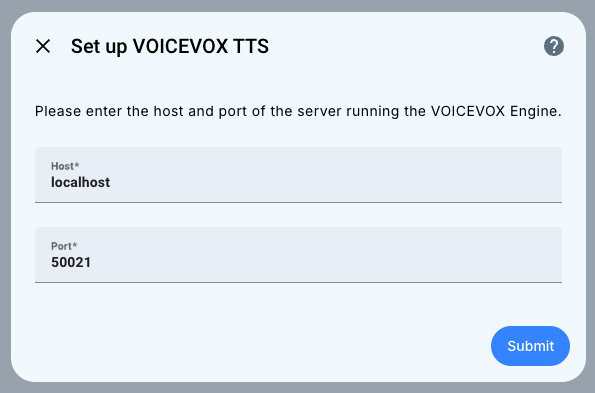
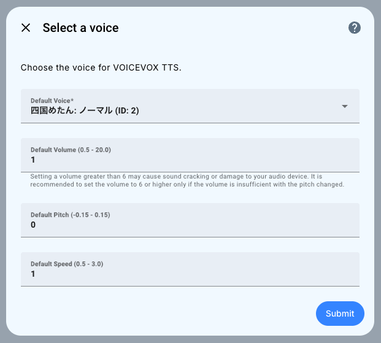
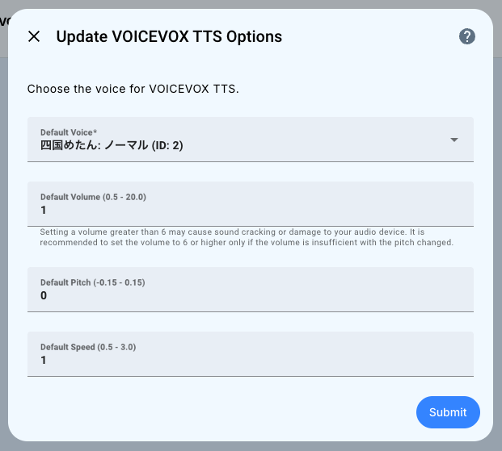
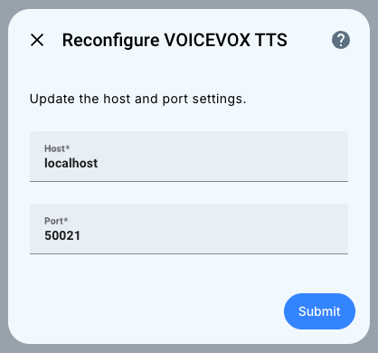
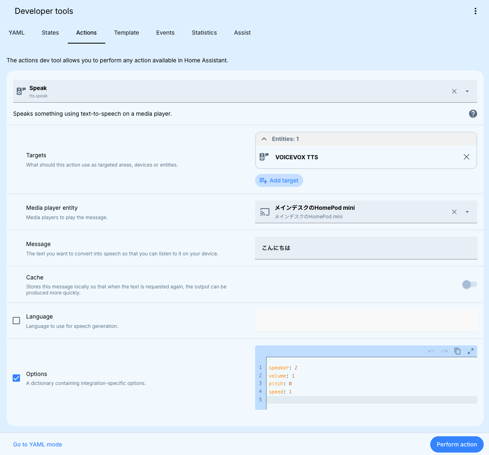

# VOICEVOX TTS Integration for Home Assistant
**English** | [日本語](docs/README-ja.md)

This custom integration provides Japanese TTS services using [VOICEVOX](https://voicevox.hiroshiba.jp/) in Home Assistant.

> [!NOTE]
> To use VOICEVOX TTS, you need a server running [VOICEVOX Engine](https://github.com/VOICEVOX/voicevox_engine).
> 
> [VOICEVOX Engine Addon](https://github.com/taikun114/Home-Assistant-VOICEVOX-Engine) is also available and can be used.

When using VOICEVOX TTS, please be sure to read [VOICEVOX's Terms of Use](https://voicevox.hiroshiba.jp/term/) and each character's Terms of Use.

> [!NOTE]
> I have confirmed that the Japanese TTS engine [AivisSpeech Engine](https://github.com/Aivis-Project/AivisSpeech-Engine), which is compatible with the VOICEVOX API, can also be used without any problems.
> 
> If you want to use it with AivisSpeech Engine, please enter the host and port of the server running the AivisSpeech Engine when setting up the VOICEVOX TTS integration.

## Install
### Via HACS
If you are using HACS (Home Assistant Community Store), click the button below or search for `VOICEVOX TTS` in HACS and install.

#### To add repository and install

> [!TIP]
> Currently this custom integration is in the default repository, so you can install it without adding a repository.

Click the button above or open HACS from the sidebar, and click `...` in the upper right corner, then open `Custom repositories`.

Once the custom repository page opens, add a repository by entering the following

- **Repository**: `https://github.com/taikun114/VOICEVOX-TTS-for-Home-Assistant`
- **Type**: `Integration`

Once you have added the repository, `VOICEVOX TTS` will appear in the list, and you can install it from there.

### Manual
Download the [latest release](https://github.com/taikun114/VOICEVOX-TTS-for-Home-Assistant/releases/latest) and extract the ZIP file.

After extracting, copy the `custom_components/voicevox_tts` folder to your Home Assistant's `config/custom_components/`. Then restart Home Assistant.

## Setup
VOICEVOX TTS can be setup through the UI.

### Initial Setup

1. Go to `Settings` → `Devices and services` in Home Assistant.
2. Click `Add Integration` and search for `VOICEVOX TTS`.
3. Enter the host and port of the server running the VOICEVOX Engine and click `Submit`.

4. Choose the voice you want to use for VOICEVOX TTS and default settings and click `Submit`.

This completes the setup.

### Change Options

From the options, you can change the voice you want to use for VOICEVOX TTS.

1. Go to `Settings` → `Devices and services` in Home Assistant.
2. Search for `VOICEVOX TTS` and click on it.
3. Click `Configure`.
4. Choose the voice you want to use for VOICEVOX TTS and default settings and click `Submit`.

This completes the changing options.

> [!NOTE]
> If the old voice is used after changing the voice (the changed voice is not used), a previously created cache may be in use.
> You need to change the text or clear the TTS cache (run the `tts.clear_cache` action).

### Reconfigure

The `Host` and `Port` configured initially can be changed from reconfigure.

1. Go to `Settings` → `Devices and services` in Home Assistant.
2. Search for `VOICEVOX TTS` and click on it.
3. Click `...` at the right of `Configure` and click `Reconfigure`.
4. Enter the host and port of the server running the VOICEVOX Engine and click `Submit`.

This completes the changing setup.

## How to use VOICEVOX TTS
### Playing from `Media`

You can play any text from the `Media` page of the Home Assistant.

1. Open the `Media` page.

   
2. Go to `Text-to-speech` → `VOICEVOX TTS` (or integration entry name).
3. Enter the text you want to play in the `Message` field, and click `SAY`.

> [!TIP]
> When playing the text, click `Web browser` in the lower right corner to change the playback device and then click `SAY` to play the text in your favorite media player.

### Playing with Actions

You can use the `tts.speak` action to play any text in your favorite media player. Of course, you can also integrate it into automation and have it play the text.

Available options are as follows:
- `speaker`: Enter the ID of the voice to use. The ID can be found in the voice list of the VOICEVOX TTS integration settings.
- `volume`: Enter the volume of the voice. `1` is the default volume. Entering too large a volume may cause sound cracking or damage to your audio device.
- `pitch`: Enter the pitch of the voice. `0` is the default pitch. Entering a value smaller than `-0.15` or larger than `0.15` may result in strange audio output.
- `speed`: Enter the playback speed of the voice. `1` is the default speed.

### Use in Assist

If you configure for use with the Home Assistant's voice assistant “Assist”, you can hear the response from Assist using the VOICEVOX TTS.

1. Go to `Settings` → `Voice Assistant` in the Home Assistant.
2. Click on the voice assistant you want to use VOICEVOX TTS with to open the settings window.
3. Change the `Text-to-speech` to the one for VOICEVOX TTS and click `Update`.

> [!NOTE]
> If you cannot select VOICEVOX TTS in the `Text-to-speech` section, please make sure that the Language in the `Configuration` is set to `Japanese` or `English`.
> VOICEVOX TTS is only available in Japanese and English, so if it is in another language, you will not be able to select it.
