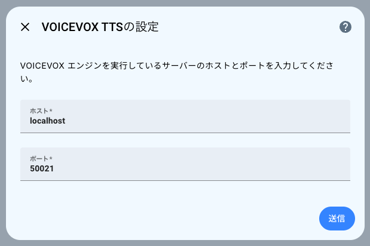
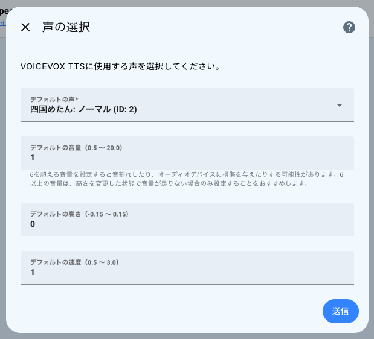
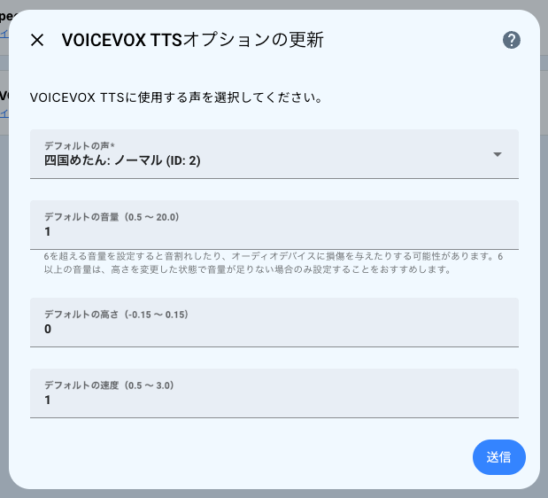
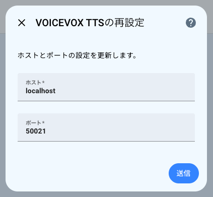
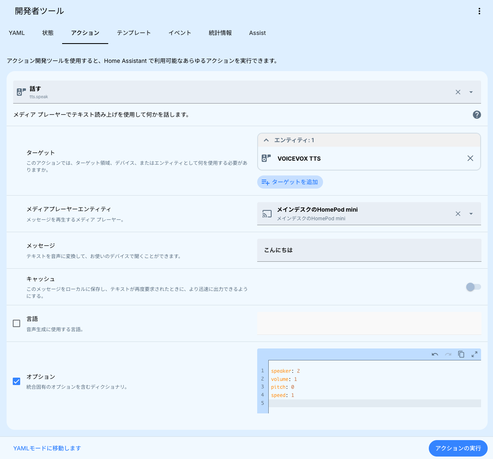

# VOICEVOX TTS統合 for Home Assistant
[English](/README.md) | **日本語**

このカスタム統合は、Home Assistantで[VOICEVOX](https://voicevox.hiroshiba.jp/)を使った、日本語のTTSサービスを提供します。

> [!NOTE]
> VOICEVOX TTSを使用するには、[VOICEVOX エンジン](https://github.com/VOICEVOX/voicevox_engine)を実行したサーバーが必要です。
>
> [VOICEVOX エンジンのアドオン](https://github.com/taikun114/Home-Assistant-VOICEVOX-Engine)もありますので、こちらを使うこともできます。

VOICEVOX TTSを利用する際は、[VOICEVOXの利用規約](https://voicevox.hiroshiba.jp/term/)および各キャラクターの利用規約を必ずご覧ください。

> [!NOTE]
> VOICEVOX APIと互換性のある日本語TTSエンジンの[AivisSpeech Engine](https://github.com/Aivis-Project/AivisSpeech-Engine)でも問題なく使用できることを確認しました。
> 
> AivisSpeech Engineで使用する場合は、VOICEVOX TTS統合のセットアップ時に、AivisSpeech Engineを実行しているサーバーのホストとポートを入力してください。

## インストール
### HACS経由
HACS（Home Assistant Community Store）をご利用の場合、以下のボタンをクリックするか、HACSで`VOICEVOX TTS`と検索してインストールしてください。

#### リポジトリを追加してインストールする場合

> [!TIP]
> 現在このカスタム統合はデフォルトリポジトリに入っているため、リポジトリを追加しなくてもインストールすることができます。

上記ボタンをクリックするか、サイドバーからHACSを開き、右上の`...`をクリックしたら`Custom repositories`を開きます。

カスタムリポジトリの画面が開いたら、以下のように入力してリポジトリを追加します。

- **Repository**: `https://github.com/taikun114/VOICEVOX-TTS-for-Home-Assistant`
- **Type**: `Integration`

リポジトリを追加できたら、`VOICEVOX TTS`が一覧に表示されるので、そこからインストールしてください。

### 手動
[最新のリリース](https://github.com/taikun114/VOICEVOX-TTS-for-Home-Assistant/releases/latest)をダウンロードし、ZIPファイルを展開します。

展開後、`custom_components/voicevox_tts`フォルダを、お使いのHome Assistantの`config/custom_components/`にコピーします。その後、Home Assistantを再起動します。

## 設定
VOICEVOX TTSは、UIから設定を行うことができます。

### 最初の設定

1. Home Assistantの`設定` → `デバイスとサービス`と進みます。
2. `統合を追加`をクリックし、`VOICEVOX TTS`と検索します。
3. VOICEVOX エンジンを実行しているサーバーのホストとポートを入力して`送信`をクリックします。

4. VOICEVOX TTSに使用するデフォルトの声とデフォルトの設定を入力して`送信`をクリックします。

以上で設定は完了です。

### オプションの変更

オプションからは、VOICEVOX TTSに使用する声を変更することができます。

1. Home Assistantの`設定` → `デバイスとサービス`と進みます。
2. `VOICEVOX TTS`と検索してクリックします。
3. `設定`をクリックします。
4. VOICEVOX TTSに使用するデフォルトの声とデフォルトの設定を入力して`送信`をクリックします。

以上でオプションの変更は完了です。

> [!NOTE]
> 声を変更しても古い声が使用される（変更後の声が使用されない）場合、以前作成されたキャッシュが使用されている可能性があります。
> 文章を変更するか、TTSのキャッシュをクリア（`tts.clear_cache`アクションを実行）する必要があります。

### 再設定

最初に設定した`ホスト`と`ポート`は、再設定から変更することができます。

1. Home Assistantの`設定` → `デバイスとサービス`と進みます。
2. `VOICEVOX TTS`と検索してクリックします。
3. `設定`の右にある`...`をクリックし、`再設定`をクリックします。
4. VOICEVOX エンジンを実行しているサーバーのホストとポートを入力して`送信`をクリックします。

以上で設定の変更は完了です。

## VOICEVOX TTSの使い方
### `メディア`から再生する

Home Assistantの`メディア`ページから任意のテキストを再生させることができます。

1. `メディア`ページを開きます。

   
2. `Text-to-speech` → `VOICEVOX TTS`（または統合エントリ名）と進みます。
3. `メッセージ`のところに再生したいテキストを入力し、`発言`をクリックします。

> [!TIP]
> テキストを再生する際、右下の`Webブラウザ`をクリックして再生デバイスを変更してから`発言`をクリックすることで、お好みのメディアプレイヤーでテキストを再生させることができます。

### アクションを使って再生する

`tts.speak`アクションを使って、お好みのメディアプレイヤーで任意のテキストを再生させることができます。もちろん、オートメーションに組み込んでテキストを再生させることも可能です。

利用可能なオプションは次の通りです。
- `speaker`: 使用する声のIDを入力します。IDは、VOICEVOX TTS統合設定の声一覧から確認できます。
- `volume`: 音声の音量を入力します。`1`がデフォルトの音量です。大きすぎる音量を入力すると音割れしたり、オーディオデバイスに損傷を与えたりする可能性があります。
- `pitch`: 音声の高さ（ビッチ）を入力します。`0`がデフォルトの高さです。`-0.15`よりも小さい値、または`0.15`よりも大きい値を指定するとおかしな音声が出力される可能性があります。
- `speed`: 音声の再生速度を入力します。`1`がデフォルトの速度です。

### Assistで使う

Home Assistantの音声アシスタント「Assist」で使えるように設定すれば、Assistからの応答を、VOICEVOX TTSを使って聞くことができます。

1. Home Assistantの`設定` → `音声アシスタント`と進みます。
2. VOICEVOX TTSを使いたい音声アシスタントをクリックして設定画面を開きます。
3. `テキスト読み上げ`をVOICEVOX TTSのものに変更し、`アップデート`をクリックします。

> [!NOTE]
> `テキスト読み上げ`のところにVOICEVOX TTSが選択できない場合、`コンフィギュレーション`の言語が`日本語`または`英語`になっていることをご確認ください。
> VOICEVOX TTSは日本語と英語にのみ対応しているため、他の言語になっていると選択できません。